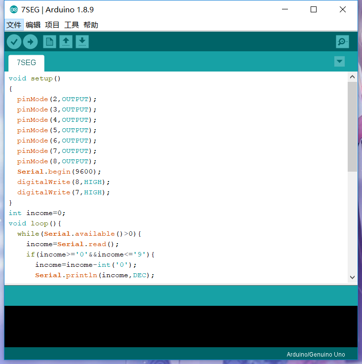
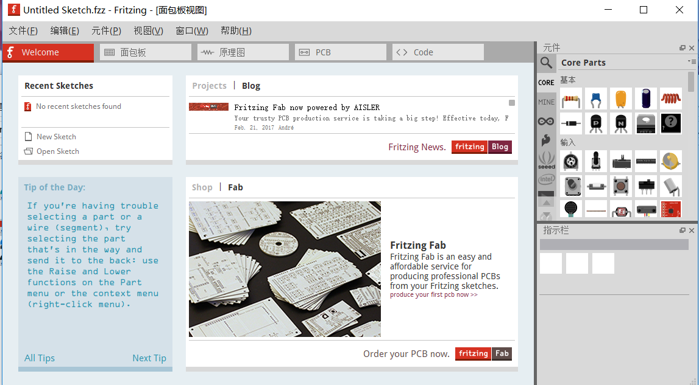
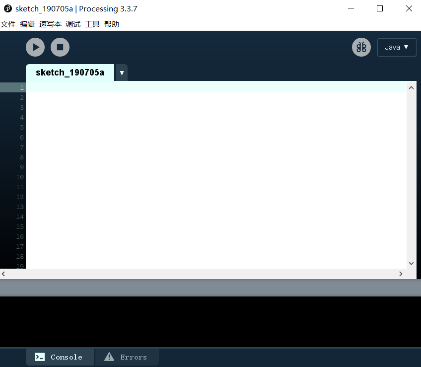
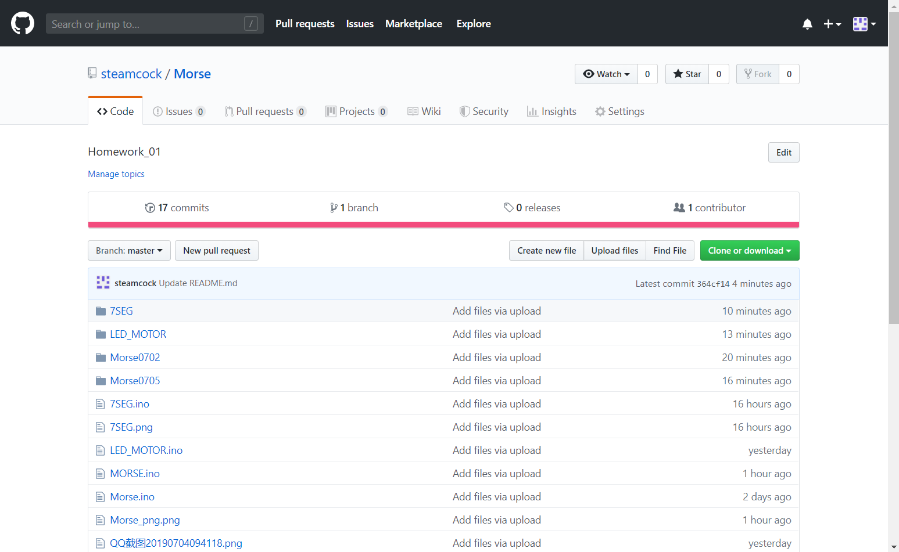
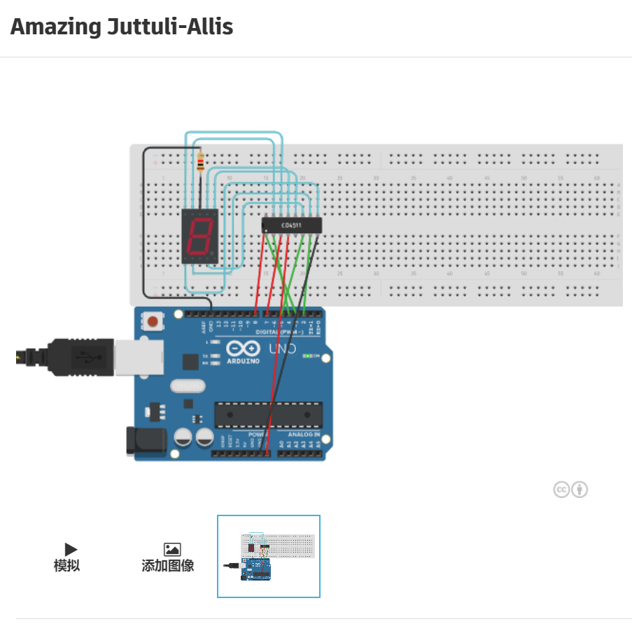
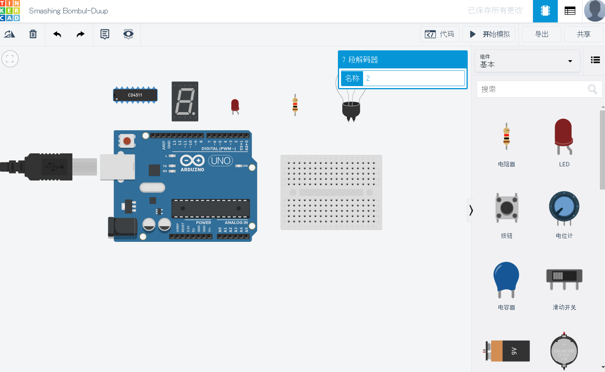
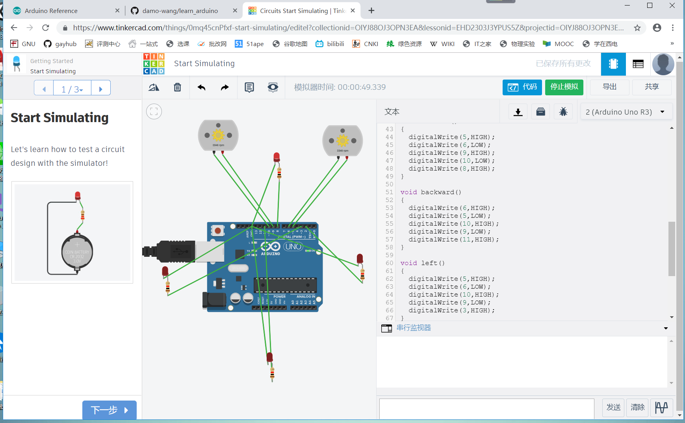
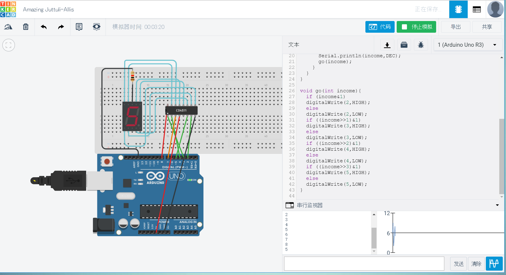
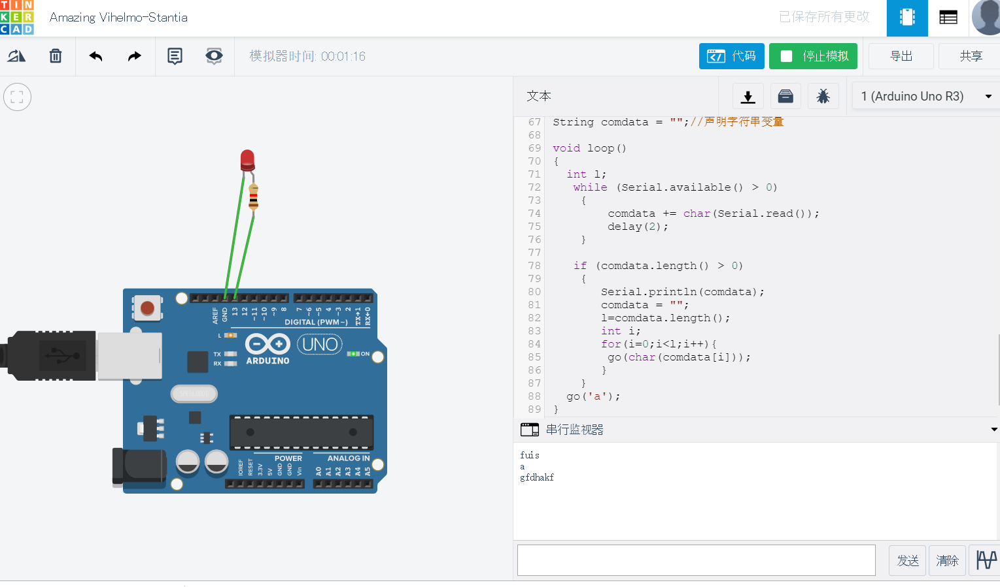

# 开源硬件课程
>steamcock-段凯忠
>2019/07/02-2019/07/05

版本信息

版本号|日期|发布人
---|---|---|
0.01|2019/07/02|段凯忠-1802010031

版本号|内容|作业
---|---|---|
0702|入门|创建GitHub账号、安装arduino\fritzing\processing
0703|Arduino编程|Morse代码，库函数形式
0704|认识电子元件及操作|1.小车代码电路图；2.数码管代码电路图
0705|总结|1.莫尔斯代码tinkercad可运行代码；2.markdown格式学习总结

## 第一天 入门介绍

> 为什么要学习开源硬件

开源硬件是与自由及开放原始码软件相同方式设计的计算机和电子硬件。

开源硬件开始考虑对软件以外的领域开源，是开源文化的一部分。

开源硬件是可以通过公开渠道获得的硬件设计，任何人可以对已有的设计进行学习，修改，发布，制作和销售。

是一个扩展性很好的平台，便于与各种设备交互,对于初学者来说，在进行一些小型项目时，它是绝佳的选择。

> 如何学习开源硬件

多**练习**

多看*原版网站*

遇到困难与同学交流
> 几个常用软件

Arduino————一款便捷灵活，方便学习，上手的开源电子原型平台

Fritzing————电子设计自动化软件

Processing————Processing is a flexible software sketchbook and a language for learning how to code within the context of the visual arts.

> 新建的GitHub账号

## 第二天 Arduino编程

> Morse 代码

int pin = 13;

void setup()

{

 pinMode(pin, OUTPUT);

}//*设置针脚*

void loop()

{

 dot(); dot(); dot();//*字母S*

 dash(); dash(); dash();//*字母O*

 dot(); dot(); dot();//*字母S*

 delay(3000);//*等待下一次输入*

}

void dot()//定义*子函数*

{

 digitalWrite(pin, HIGH);

 delay(250);

 digitalWrite(pin, LOW);

 delay(250);

}

void dash()

{
 digitalWrite(pin, HIGH);

 delay(1000);

 digitalWrite(pin, LOW);

 delay(250);
}

>库函数形式

#include "Arduino.h"

#include "Morse.h"

Morse::Morse(int pin)//*⽤来指定该函数是Morse类的成员函数*

{
 pinMode(pin, OUTPUT);//*设置针脚为输出*

 _pin = pin;//*加下划线是⼀种约定俗成的不成⽂规范让我们既能区分传进来的pin参数，也能清晰地知道它的private私有性质*

}

void Morse::dot()

{

 digitalWrite(_pin, HIGH);//*设置针脚电平以改变LED状态*

 delay(250);

 digitalWrite(_pin, LOW);

 delay(250); 

}

void Morse::dash()

{

 digitalWrite(_pin, HIGH);

 delay(1000);

 digitalWrite(_pin, LOW);

 delay(250);

}
- 在代码库⽬录⾥（sketchbook中的libraries⽬录），创建⼀个叫Morse的⼦⽬录
- 把Morse.h和Morse.cpp拷⻉到Morse⽬录⾥
- 启动Arduino IDE，打开Sketch > Import Library菜单，此时应能看到Morse菜单项。

> Arduino常用函数

 - digitalWwrite(pin,value);  //*向pin口写入高电平或低电平*
 - digitalRead（pin）; //*读取pin端口的电位*
 - analogRead(pin);//*读取模拟端口pin的模拟值（0~1023）*

 - Serial.available(); //*获取可行串行端口读取的字节数*

 - Serial.read（）; //*读取读入的串行数据，返回其ASCII值*
 - Serial.println(); //*将数据打印到串行端口*

 ## 第三天 认识电子元件及操作

 > 用 Tinkercad 模拟电路
 

- 图中使用了UNO开发板，面包板，CD4511贴片，7SEG，电阻

> Tinkercad网页

> 小车代码及电路图

void setup()

{

  pinMode(5, OUTPUT);

  pinMode(6, OUTPUT);

  pinMode(9, OUTPUT);

  pinMode(10, OUTPUT);

  pinMode(8, OUTPUT);//f

  pinMode(11,OUTPUT);//b

  pinMode(2, OUTPUT);//r

  pinMode(3, OUTPUT);//l

  Serial.begin(9600);

}

int income=0;

void loop()

{
  if(Serial.available()>0)

    {

      income=Serial.read();

        switch(income)

        {

          case 'f':

              forward();

              break;

            case 'b':

              backward();

              break;

            case 'l':

              left();
              break;

            case 'r':

              right();

              break;

            case 's':

              stop();

              break;

            default:

              break;
        }
    }
}

void forward()

{
  digitalWrite(5,HIGH);

  digitalWrite(6,LOW);

  digitalWrite(9,HIGH);

  digitalWrite(10,LOW);

  digitalWrite(8,HIGH);
}

void backward()

{
  digitalWrite(6,HIGH);

  digitalWrite(5,LOW);

  digitalWrite(10,HIGH);

  digitalWrite(9,LOW);

  digitalWrite(11,HIGH);

}

void left()
{

  digitalWrite(5,HIGH);

  digitalWrite(6,LOW);

  digitalWrite(10,HIGH);

  digitalWrite(9,LOW);

  digitalWrite(3,HIGH);

}

void right()
{
  digitalWrite(6,HIGH);

  digitalWrite(5,LOW);

  digitalWrite(9,HIGH);

  digitalWrite(10,LOW);

  digitalWrite(2,HIGH);

}

void stop()

{
  digitalWrite(5,LOW);

  digitalWrite(6,LOW);

  digitalWrite(9,LOW);

  digitalWrite(10,LOW);

}
> 数码管代及码电路图

void setup()
{
  pinMode(2,OUTPUT);
  pinMode(3,OUTPUT);
  pinMode(4,OUTPUT);
  pinMode(5,OUTPUT);
  pinMode(6,OUTPUT);
  pinMode(7,OUTPUT);
  pinMode(8,OUTPUT);
  Serial.begin(9600); 
  digitalWrite(8,HIGH); 
  digitalWrite(7,HIGH);
}
int income=0;
void loop(){
  while(Serial.available()>0){
    income=Serial.read();
    if(income>='0'&&income<='9'){
      income=income-int('0');
      Serial.println(income,DEC);
      go(income);
    }
  }
}

void go(int income){
  if (income&1)
  digitalWrite(2,HIGH);
  else
  digitalWrite(2,LOW);
  if ((income>>1)&1)
  digitalWrite(3,HIGH);
  else
  digitalWrite(3,LOW);
  if ((income>>2)&1)
  digitalWrite(4,HIGH);
  else
  digitalWrite(4,LOW);
  if ((income>>3)&1)
  digitalWrite(5,HIGH);
  else
  digitalWrite(5,LOW);
}//*此处理方法借助了CD4511芯片真值表中的规律*

## 第四天 总结

> 莫尔斯代码tinkercad可运行代码

int pin=(13);
 
void setup()
{
  pinMode(pin,OUTPUT);
  Serial.begin(9600);      //设定的波特率
}
 
void dot()
{
 digitalWrite(pin, HIGH);
 delay(250);
 digitalWrite(pin, LOW);
 delay(250);
}
void dash()
{
 digitalWrite(pin, HIGH);
 delay(1000);
 digitalWrite(pin, LOW);
 delay(250);
}
void pause(){
  digitalWrite(pin,LOW);
  delay(250*2);
}
void cut(){
  digitalWrite(pin,LOW);
  delay(250*4);
}

void go(char c){
  switch(c){
    case 'a':dot();dash();break;
    case 'b':dash();dot();dot();dot();break;
    case 'c':dash();dot();dash();dot();break;
    case 'd':dash();dot();dot();break;
    case 'e':dot();break;
    case 'f':dot();dot();dot();break;
    case 'g':dash();dash();dot();break;
    case 'h':dot();dot();dot();dot();break;
    case 'i':dot();dot();break;
    case 'j':dot();dash();dash();dash();break;
    case 'k':dash();dot();dash();break;
    case 'l':dot();dash();dot();dot();break;
    case 'm':dash();dash();break;
    case 'n':dash();dot();break;
    case 'o':dash();dash();dash();break;
    case 'p':dot();dash();dash();dot();break;
    case 'q':dash();dash();dot();dash();break;
    case 'r':dot();dash();dot();break;
    case 's':dot();dot();dot();break;
    case 't':dash;break;
    case 'u':dot();dot();dash();break;
    case 'v':dot();dot();dot();dash();break;
    case 'w':dot();dash();dash();break;
    case 'x':dash();dot();dot();dash();break;
    case 'y':dash();dot();dash();dash();break;
    case 'z':dash();dash();dot();dot();break;
    case ' ':cut();break;
    case '\t':cut();cut();break;
    default:;
  }
    pause();
}

String comdata = "";//声明字符串变量
 
void loop() 
{
  int l;
   while (Serial.available() > 0)  
    {
        comdata += char(Serial.read());
        delay(2);
    }
    
   if (comdata.length() > 0)
    {
       Serial.println(comdata);
       comdata = "";
       l=comdata.length();
       int i;
       for(i=0;i<l;i++){
        go(char(comdata[i]));
       }
    }
}

> markdown 格式学习总结

## Markdown 是一种轻量级标记语言，它允许人们使用易读易写的纯文本格式编写文档。

# Markdown 语言在 2004 由约翰·格鲁伯（英语：John Gruber）创建。

### Markdown 编写的文档可以导出 HTML 、Word、图像、PDF、Epub 等多种格式的文档。

> Markdown 编写的文档后缀为 .md, .markdown。

---|---|

- |使用 = 和 - |标记一级和二级标题

===|===|
+ 使用 = 和 - |标记一级和二级标题

# 一级标题
## 二级标题
### 三级标题
#### 四级标题
##### 五级标题
###### 六级标题

*斜体文本*
_斜体文本_
**粗体文本**
__粗体文本__
***粗斜体文本***
___粗斜体文本___

1. 第一项：
    - 第一项嵌套的第一个元素
    - 第一项嵌套的第二个元素
2. 第二项：
    - 第二项嵌套的第一个元素
    - 第二项嵌套的第一个元素

    * 第一项
    > 学的不仅是技术更是梦想
* 第二项

  > 总结：短暂的四天学习时间里，我初步了解了开源硬件Arduino的使用方法，学会了LED、步进电机、七段数码管及解码器的使用方法。为今后学习及操作其他微机系统积累下宝贵经验。

